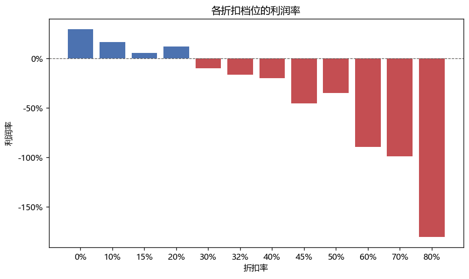
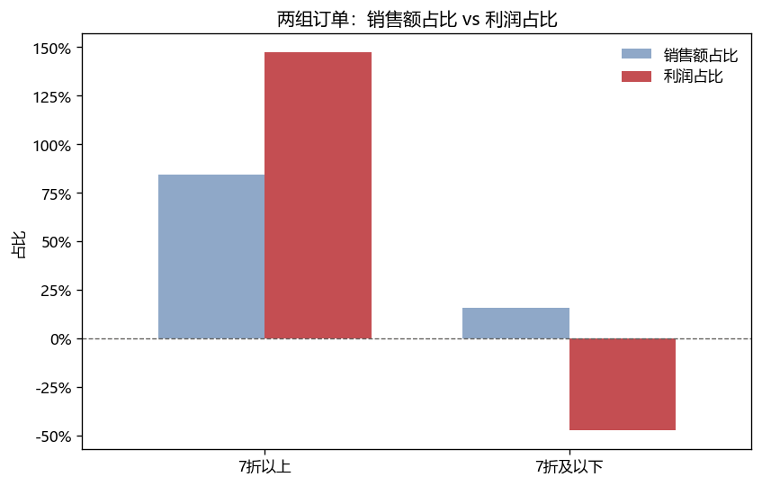
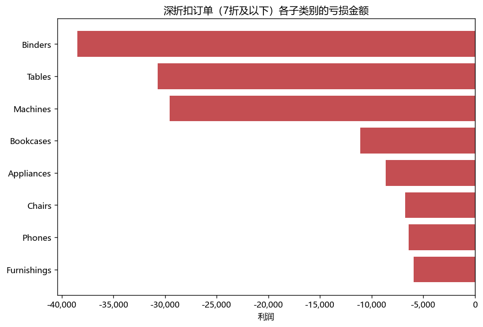

# 折扣是否在降低利润——基于9994条零售订单的分析

> **结论**：
打七折及以下，亏损占总利润的47.3%，主要集中在 Binders、Tables、Machines 这几个子类别，如果是主动促销造成的，以后可减少这种促销。
若要判断是主动促销，还是被迫竞争，还需要结合内部的促销申请记录、竞品价格数据才能判断，单靠这份数据回答不了这个问题。
打八折和不打折为主要销售档位，两者合计销量占总销量的84.3%（按销售数量计）。


## 项目背景

这段数据是Kaggle上的一个超市零售数据、9994行21列、时间跨度为2014-1-3~2017-12-30。

现如今卖东西有很多是打折卖的，我自己也喜欢买打折的衣服，所以想知道商家打折之后到底还赚不赚钱。


## 数据来源

- **数据集**：Sample Superstore
- **原始出处**：Tableau 官方样例数据集
- **下载地址**：https://www.kaggle.com/datasets/mudasirkhan01/sample-superstore
- **许可**：Apache 2.0（注意：项目根目录的 MIT 许可只覆盖我写的代码，不覆盖数据）
- **文件校验**：MD5 `b3066905e9eb4d477453d473dbf20c02`

## 关键发现

### 1. 折扣打到 7 折及以下，利润率转负



折扣 30% 时利润率 -10%，80% 时 -180%， 折扣越深亏得越多。

### 2. 深折扣订单 15.8% 的销售额，吃掉 47.3% 的利润



打七折及以下，亏损占总利润的47.3%

### 3. 亏损集中在少数几个子类别



亏损主要集中在 Binders、Tables、Machines 这几个子类别

## 数据处理说明

1、解码使用latin-1，原使用UTF-8产生报错，原因是文件里出现0xA0，这在UTF-8里是非法的。而latin-1它一共就256个位置，0x00 到 0xFF，一个字节对一个字符，不存在非法状态。

2、Order Date 原是字符串格式，将其改为了日期格式。

3、对于 7 折及以下亏损利润的算法，是将这个区间的所有利润全部加起来，不是只把 Profit < 0 的行加起来。

4.使用 pandas 和 SQL 各做了一遍，结论互相验证。
两条路径共用同一个 clean.py,所以这个对账验证的是计算逻辑,不覆盖清洗逻辑;清洗层另用行数校验(raw / clean / db 三处均为 9,994 行)覆盖。

## 项目结构
```
sales-analysis
├─ data
│  └─ raw
│     └─ Sample_Superstore.csv
├─ LICENSE
├─ notebooks
│  ├─ 01_discount_vs_profit.ipynb
│  └─ 02_sql_version.ipynb
├─ outputs
│  └─ figures
│     ├─ 01_折扣档位利润率.png
│     ├─ 02_占比对比.png
│     └─ 03_子类别亏损.png
├─ README.md
├─ requirements.txt
├─ sql
│  ├─ 01_discount_by_band.sql
│  ├─ 02_deep_discount_share.sql
│  └─ 03_loss_by_subcategory.sql
└─ src
   ├─ clean.py
   └─ load_to_sqlite.py

```

## 如何运行

以下命令都在**项目根目录**（`sales-analysis/`）下执行。

**1. 安装依赖**

```bash
pip install -r requirements.txt
```

**2. 生成数据库**（只运行 pandas 版分析的话可以跳过）

`data/processed/` 是代码生成的目录，不在仓库里，需要自己跑一次：

```bash
python -m src.load_to_sqlite
```

成功会输出 `9,994行`，并在 `data/processed/` 下生成 `superstore.db`。

**3. 运行 notebook**

用 VS Code 打开项目文件夹，然后：

- `notebooks/01_discount_vs_profit.ipynb` —— pandas 版本，从上到下依次运行
- `notebooks/02_sql_version.ipynb` —— SQL 版本，**需要先完成第 2 步**

## 技术栈

Python 3.12 · pandas 2.2.2 · matplotlib 3.9.2 · SQLite 3.45
